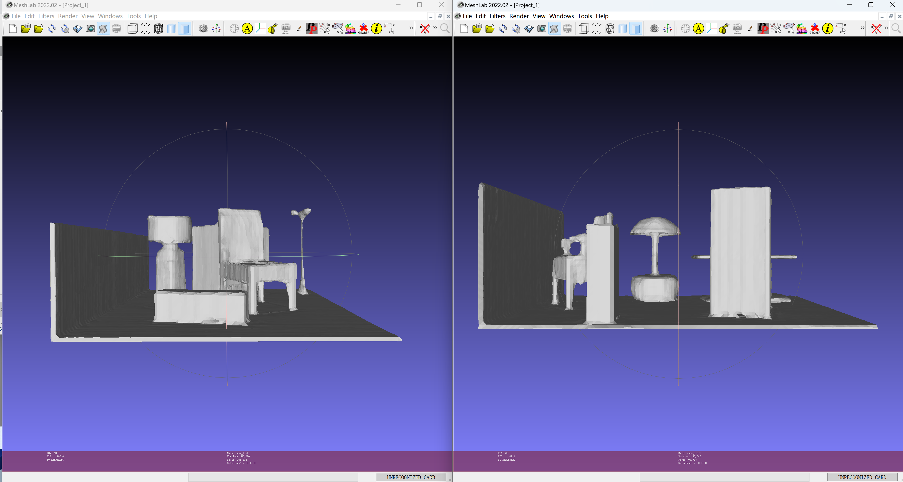

# Pset-3d

## Installation
In order to set up the environment in google Colab, instead of creating conda environment shown in the original github page, we only need to install several dependencies. 

#### Change the Python version
Directly installing dependencies using the python version in Colab may cause some errors and issues. Therefore, hereby provide a way of environment setup solving this:

Firstly, you can degrade the python version of Colab using (you may find [changing python version](https://stackoverflow.com/questions/63168301/how-to-change-the-python-version-from-default-3-5-to-3-8-of-google-colab) useful) 
```
!sudo apt-get install python3.7
!sudo update-alternatives --install /usr/bin/python3 python3 /usr/bin/python3.7 1
```
The second line will prompt you to choose a python version among all versions you have. Then run following to make it work
```
!sudo update-alternatives --config python3
```
**Note**: you can always check the python version using `!python --version`.

Since the python version is now changed, run the following to keep the version of `pip` and `distutils` compatible with python
```
!sudo apt install python3-pip
!sudo apt install python3.7-distutils
```
The following can be run to install several useful packages
```
!pip install numpy cython pandas plyfile scikit-image
```

#### Compile the extension modules
Next, we can compile the extension models via
```
python setup.py build_ext --inplace
```
**Note**: issues may come up when running this command and you may solve with the following:
1. You may need to modify `setup.py` a little bit if meeting compiling errors following [compiling issues](https://github.com/autonomousvision/convolutional_occupancy_networks/issues/33).
2. You may need to run the following before compiling (see resource that may be useful [setup script exited with error: command 'x86_64-linux-gnu-gcc' failed with exit status 1](https://stackoverflow.com/questions/26053982/setup-script-exited-with-error-command-x86-64-linux-gnu-gcc-failed-with-exit))
```
!apt-get install python3.7-dev
!sudo apt-get install build-essential python3-dev libssl-dev libffi-dev libxml2 libxml2-dev libxslt1-dev zlib1g-dev
```

#### Install PyTorch and other dependencies
After successfully compiling the modules, you can install PyTorch dependencies and other necessary packages. Run the following to install PyTorch
```
!pip install torch==1.9.0+cu111 torchvision==0.10.0+cu111 -f https://download.pytorch.org/whl/torch_stable.html
```
Then install `torch_scatter` using
```
!pip install torch-scatter==2.0.9 -f https://pytorch-geometric.com/whl/torch-1.9.0+cu111.html
```
**Note**: the torch version and cuda version for `torch` and `torch_scatter` should keep same.

Finally, install other dependencies with
```
!pip install tensorboardx==1.4
!pip install matplotlib trimesh pyyaml tqdm
```


## Demo
You can run a simple demo to see if the environment is successfully set up. This part directly follows [demo](https://github.com/autonomousvision/convolutional_occupancy_networks/blob/master/README.md#demo) in the original github page for Convolutional Occupancy Networks. You can simply run the demo to reconstruct a synthetic indoor scene.

First, run the script to get the demo data:
```
bash scripts/download_demo_data.sh
```
Next, generate a mesh from synthetic room dataset:
```
python generate.py configs/pointcloud/demo_syn_room.yaml
```
The generated mesh data can be found in `out/demo_syn_room`. The mesh file `.off` can be simply visualized using [MeshLab](https://www.meshlab.net/).




## Data Preparation
In this project, we are going to use the data of Stanford Bunny, which can be downloaded from [`bunny_data`](https://github.com/UCLA-VMG/Pset-3d/tree/main/bunny_data). Data preparation follows the [Occupancy Networks] (https://github.com/autonomousvision/occupancy_networks#preprocessed-data). After git clone the project of Occupancy Networks, enter the project directory and run the following to sample the data:
```
!mkdir -p prepared_data/bunny/pointcloud \
      prepared_data/bunny/points \
      prepared_data/bunny/mesh

%cd scripts/

# sample the mesh to obtain pointcloud
!python sample_mesh.py ../bunny_data/mesh \
      --pointcloud_folder ../prepared_data/bunny/pointcloud \
      --points_folder ../prepared_data/bunny/points \
      --mesh_folder ../prepared_data/bunny/mesh \
      --packbits --float16 \
```
This will create the dataset sampled on mesh of Stanford Bunny in 'prepared_data': the output (scaled) mesh, query points and output pointcloud data. You may want to use more input argument options (`--points_uniform_ratio`, `--points_sigma`) to apply different sampling strategy. Later you may need to consider adjust these to achieve better performance.
Since we only use one object, i.e. a single Stanford Bunny, for training and testing, the splitt files for train/val/test data would be the same and can be created either by modifying ['scripts/create_split.py'](https://github.com/autonomousvision/occupancy_networks/blob/master/scripts/create_split.py) or using the following:
```
# prepare overfit dataset, i.e. one object for train, val and test
import os
import random


in_folder = "../prepared_data"

all_samples = [name for name in os.listdir(in_folder)
               if os.path.isdir(os.path.join(in_folder, name))]


train_set = val_set = test_set = all_samples[:3]

with open(os.path.join(in_folder, 'train.lst'), 'w') as f:
    f.write('\n'.join(train_set))

with open(os.path.join(in_folder, 'val.lst'), 'w') as f:
    f.write('\n'.join(val_set))

with open(os.path.join(in_folder, 'test.lst'), 'w') as f:
    f.write('\n'.join(test_set))
```
Now you should have all the split files end with `.lst` inside the `prepared_data` folder, which is ready for training and testing.

## Training

## Test and Evaluation


<!-- 


### Reconstruct Large-Scale Matterport3D Scene
You can now quickly test our code on the real-world scene shown in the teaser. To this end, simply run:
```
python generate.py configs/pointcloud_crop/demo_matterport.yaml
```
This script should create a folder `out/demo_matterport/generation` where the output meshes and input point cloud are stored.

**Note**: This experiment corresponds to our **fully convolutional model**, which we train only on the small crops from our synthetic room dataset. This model can be directly applied to large-scale real-world scenes with real units and generate meshes in a sliding-window manner, as shown in the [teaser](media/teaser_matterport.gif). More details can be found in section 6 of our [supplementary material](http://www.cvlibs.net/publications/Peng2020ECCV_supplementary.pdf). For training, you can use the script `pointcloud_crop/room_grid64.yaml`.


### Reconstruct Synthetic Indoor Scene
<div style="text-align: center">

</div>

You can also test on our synthetic room dataset by running: 
```
python generate.py configs/pointcloud/demo_syn_room.yaml
```
 -->
